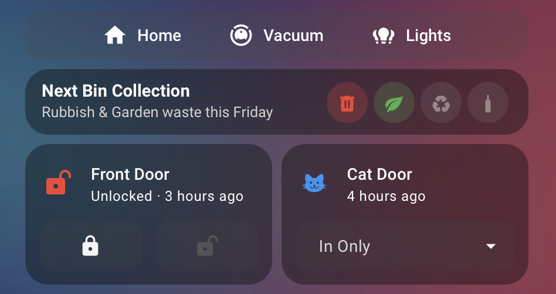

# Tabbed Section Card

A Home Assistant Lovelace card with a tab bar where **every tab is a full sections-view section**: the same
12-column grid, `grid_options` sizing and per-card `visibility` you get in a normal section, and the same
card picker / Config / Visibility / Layout editor when you add cards.



Requires a **sections** view. Developed and tested on Home Assistant 2026.9.

## Features

- Every tab is a real section: 12-column grid, `grid_options`, per-card `visibility`.
- Styled like HA tile features, so it follows your theme (selected-tab `color`, default grey).
- Visual editor with HA's own card picker and card editor (Config / Visibility / Layout).
- `idle_return`: drift back to your default tab on a wall tablet.
- Switch tabs from any other card, no browser_mod needed.

## Install

**HACS (custom repository):** HACS → ⋮ → Custom repositories → add `https://github.com/Greminn/ha-tabbed-section-card`
as type *Dashboard* → download **Tabbed Section Card**.

**Manual:** copy `tabbed-section-card.js` from the latest release to `config/www/`, then add a dashboard resource
`/local/tabbed-section-card.js` (type *JavaScript module*).

## Configuration

```yaml
type: custom:tabbed-section-card
default_tab: home      # tab id, name or index
idle_return: 60        # seconds of no interaction before returning to default_tab (0 / omit = never)
tab_display: both      # both | icon | label
align: justify         # justify | start | center | end
color: grey            # selected tab: HA colour name or any CSS colour
tabs:
  - name: Home
    id: home           # optional; defaults to a slug of name
    icon: mdi:home
    cards:
      - type: tile
        entity: light.living_room
        grid_options: { columns: 6, rows: 2 }
  - name: Vacuum
    icon: mdi:robot-vacuum
    cards: []
```

Add `grid_options: { columns: 12, rows: auto }` to the card itself in the parent section
(this is the default) so the tab bar spans the section.

### Switching tabs from another card

Any card can switch a tab, no browser_mod needed:

```yaml
tap_action:
  action: fire-dom-event
  tabbed_section_card:
    tab: vacuum        # tab id, name or index
```

## Editing

Open the card editor from the dashboard's edit mode. Manage tabs (add, reorder, duplicate, delete), then pick a
tab and add / edit / reorder / copy cards with HA's own card editor, including its Layout and Visibility tabs.

## How it works

Each tab renders HA's own `hui-section` element, so layout and visibility behave exactly like a real section.
This relies on internal frontend elements (`hui-section`, `hui-card-element-editor`, `hui-card-picker`), which HA
does not treat as a public API; see CLAUDE.md.

## Development

```
npm install
npm run build   # dist/tabbed-section-card.js
npm run lint
```

A generic example config is in `examples/basic.yaml`.
